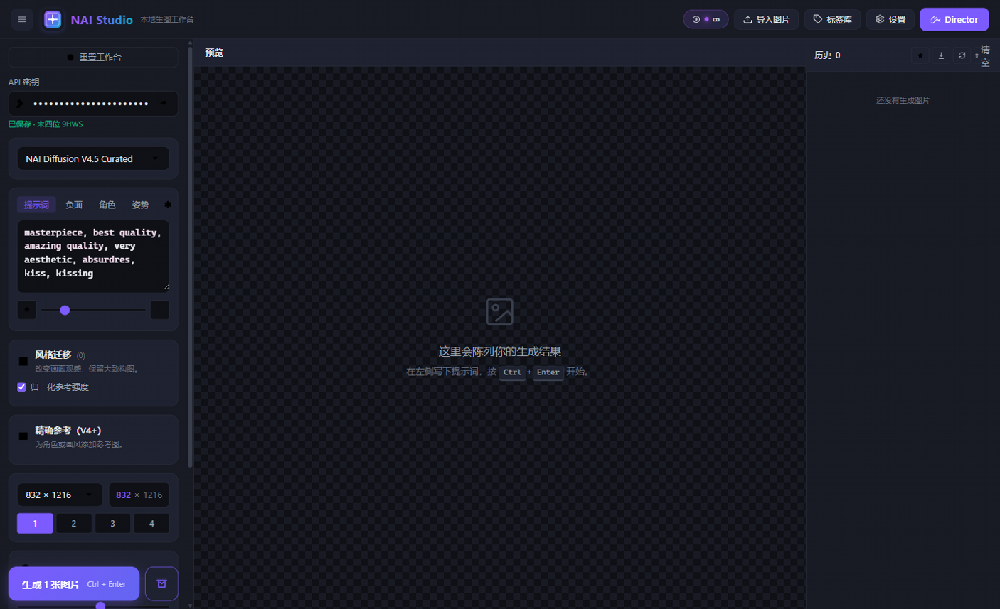
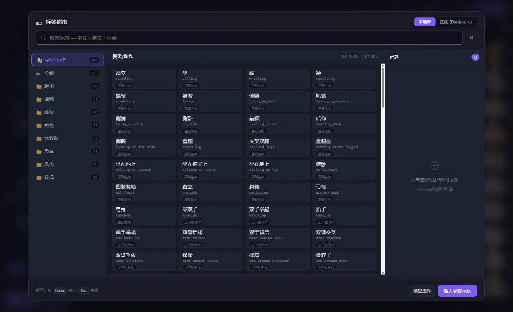
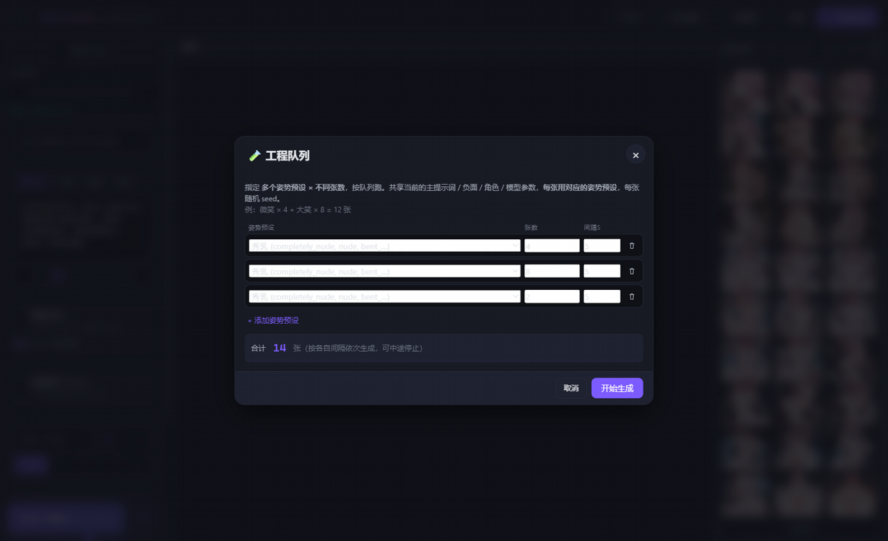
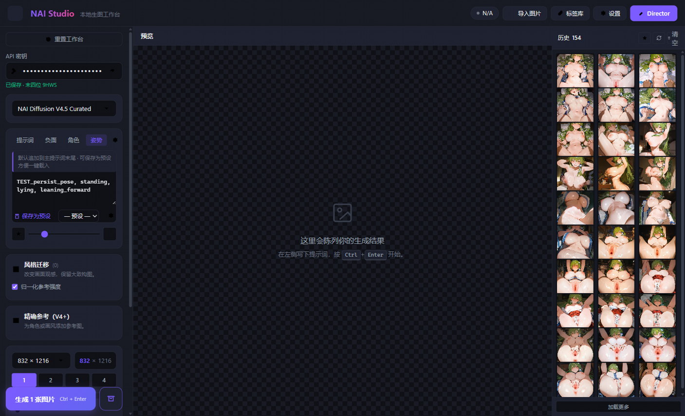

# NAI Studio · 本地生图工作台

> 像用 [studio.mmw.ink](https://studio.mmw.ink/novelai-byok) 那样在本地浏览器里调用 NovelAI 的 API，
> **专为利用 NAI 免费无限小图连续出图而设计**——所有数据留在你自己的电脑上。

[](LICENSE)
[](https://www.php.net)
[](https://httpd.apache.org)
[](https://mariadb.org)
[](https://novelai.net)

[English](#) · **简体中文**

---

## ✨ 这是什么

一个开箱即用的本地网站，桥接你的 [NovelAI](https://novelai.net) 账号和你的浏览器。
把 API Key 输一次，剩下的就是"配队列 → 连续跑 → 收一堆图"的爽感：

### 🎯 核心优势：**队列连续生图**

NAI 对 Paper / Tabletop 会员的**小图（640×640 或 832×1216 以下）是不限量的**——
其他工具让你"点一次出一张"，NAI Studio 让你"配好一组姿势 × 张数，关浏览器，让它自己跑完"：

- 🧪 **姿势工程队列** — 预设多组姿势 × 不同张数，按队列跑（如"微笑×4 + 大笑×8 + 嘟嘴×2 = 14 张"）
- 🚀 **小图无限模式** — 自动选用 NAI unlimited 尺寸，间隔可设为 0（连续生图）
- 📊 **今日已生统计** — 顶栏显示"今日已生 N 张"，日限额心里有数
- 🖥 **CLI 后台模式** — 一键复制 `php generate.php` 命令到剪贴板，关浏览器继续跑
- 📦 **一键打包下载** — 把历史图按"全部/收藏"批量打成 zip，含 `manifest.json`（prompt/seed/参数）

### 🛠 其他特性

- 🪄 **NAI 全模型**：V4.5 Curated / Full、V4、V3、Furry 3，5 个模型一键切换
- 🎯 **参考图全功能**：Vibe Transfer、Precise References、img2img、inpainting、mask editor
- 🇨🇳 **中文友好**：标签库内置 500+ 常用 Danbooru 词条的中文翻译 + 187 个姿势/动作 curated 词库
- 🗂 **预设统一管理**：主/角色/姿势 三类预设共享"设置 → 预设"面板（收藏、删除、搜索）
- 🖼 **元数据兼容**：导入 PNG/iTXt/SD `parameters` 自动回填提示词
- 🌗 **三主题**：暗色 / 极夜 / 浅色，自动跟随系统

---

## 📸 截图

| | |
|---|---|
| **顶部 + Logo**<br>渐变 Logo · 顶栏 pill · lucide 图标 |  |
| **姿势/动作词库**<br>左面板左侧紫色"姿势/动作"分类 |  |
| **工程队列 modal**<br>多组预设 × 张数 → 队列跑 |  |
| **姿势 tab**<br>textarea + 预设下拉 + 管理按钮 |  |

---

## 🛠 技术栈

| 层 | 选型 |
|---|---|
| 前端 | 原生 **ES Modules + CSS Variables**（无构建步骤，刷新即生效） |
| 后端 | **PHP 8.2**（autoload / 错误处理 / RESTful 风格 API） |
| 数据库 | **MariaDB 10.4**（通过 PDO） |
| Web 服务器 | **Apache 2.4**（XAMPP 自带） |
| 存储 | 本地文件系统（图片分片 `/storage/images/<hash2>/<id>_<rand>.png`） |
| 加密 | API Key 用 **AES-256-GCM** 入库（key 派生自 `config.encryption_key`） |

为什么不引入构建工具 / 框架？**为了让你能 fork 下来直接跑**——`git clone` → 启动 Apache → 完事。
所有依赖都是 XAMPP 自带的 extension。

---

## 📋 系统要求

- **操作系统**：Windows 10/11（dev 在 Windows 上；macOS/Linux 也能跑，路径调整即可）
- **环境**：[XAMPP 8.2.x](https://www.apachefriends.org/)（含 Apache + MariaDB + PHP 8.2）
- **PHP 扩展**：`pdo_mysql`、`curl`、`json`、`openssl`、`zip`（XAMPP 默认都有）
- **浏览器**：任何现代浏览器（Chrome / Edge / Firefox）
- **NovelAI 账号**：[订阅 Opus / Tabletop / Paper](https://novelai.net) 后到 [novelai.net/user/settings](https://novelai.net/user/settings) 取 API Key

---

## 🚀 快速开始

### 1. 装 XAMPP

```powershell
winget install --id ApacheFriends.Xampp.8.2 -e --accept-package-agreements
```

或从 [apachefriends.org](https://www.apachefriends.org/) 下载。默认装在 `C:\xampp`。

### 2. 克隆 / 下载项目

把项目放到任意路径（开发用 `D:\anima\nai-studio`）：

```powershell
git clone https://github.com/ywclgl258/nai-studio-local.git D:\anima\nai-studio
```

然后建一个 junction 让 Apache 看到 `public/`：

```powershell
New-Item -ItemType Junction -Path "C:\xampp\htdocs\nai-studio" -Target "D:\anima\nai-studio\public"
```

### 3. 启动 Apache + MySQL

```powershell
# 用 XAMPP 控制面板点 Start，或：
& "C:\xampp\apache_start.bat"
& "C:\xampp\mysql_start.bat"
```

### 4. 初始化数据库

```powershell
# 建库 + 表 + 种子数据
C:\xampp\php\php.exe schema\001_init.sql.php
C:\xampp\php\php.exe schema\002_categories.sql.php
C:\xampp\php\php.exe seed\seed_categories.php
C:\xampp\php\php.exe seed\seed_tags.php
```

> 也可以直接用 `C:\xampp\mysql\bin\mysql.exe -uroot nai_studio < schema\001_init.sql` 走 SQL 文件。

### 5. 打开浏览器

访问 **`http://localhost/nai-studio/`**

首次打开，左侧 **API 密钥** 输入框 → 粘贴你的 NovelAI Key → 自动保存（加密存库）。

---

## ⚙️ 配置

主配置文件 [`src/config.php`](src/config.php)：

| 项 | 用途 | 默认 |
|---|---|---|
| `nai.generate_url` | NAI 生图端点 | `https://image.novelai.net/ai/generate-image` |
| `nai.user_url` | NAI 用户/订阅端点 | `https://api.novelai.net/user/subscription` |
| `nai.proxy` | 代理（用户走中转 API 时填） | `null` |
| `paths.images/thumbs/uploads/cache/logs` | 运行时目录 | 都指向 `public/storage/*` |
| `encryption_key` | AES-256-GCM 派生 key | `naistudio-dev-key-CHANGE-ME-...` ← **生产前必改** |

可视化配置在 Web 端：

```
设置 → 常规    API Key、Anlas、代理、模型
设置 → 界面    主题、布局、缩略图大小
设置 → 预设    主/角色/姿势 三类预设统一管理
设置 → 一键操作 标签库导入、清理缓存、批量导出
设置 → 数据    数据库备份、清空历史、清空图库
```

---

## 📖 使用指南

### 写提示词

- 支持 **NAI 标准强调语法**：`{tag:1.2}`、`(tag)`、`[tag]`
- **质量标签**预设：点 ⭐ 按钮插入 `masterpiece, best quality, absurdres` 等
- **提示词片段**：自己攒一套常用的（比如"水手服 + 红瞳 + 长发"），一键插入

### 姿势 / 动作

姿势 tab 提供三种姿势来源，按场景选：

1. **手动写**：textarea 里直接写英文 tag（最灵活）
2. **姿势预设**：常用姿势存成预设，下次下拉选（设的 `微笑 / 大笑 / 嘟嘴`）
3. **姿势/动作词库**：在"标签库 → 姿势/动作"分类里挑，187 个 curated 中文词（站立 / 坐 / 跪 / 双手叉腰 / 比心 / 公主抱...）

### 工程队列（批量生图）

"生成 1 张" 按钮下方有 **工程队列** 链接。配置示例：

| 姿势预设 | 张数 | 间隔 |
|---|---|---|
| 微笑 | 4 | 5s |
| 大笑 | 8 | 5s |
| 嘟嘴 | 2 | 5s |

合计 14 张，依次跑，每张独立 seed，可中途 ⏹ 停止。

### 参考图

- **风格迁移**（Vibe Transfer）：拖图进去，AI 学它的"调子"，构图大致不变
- **精确参考**（V4+）：拖图进去，AI 严格还原角色或画风
- **底图**（img2img）：拖图进去，按 `strength` 改图
- **局部重绘**：用 mask editor 涂要重画的区域

### 画廊

右侧历史 sidebar：
- 🖱 单击：放大到主预览区
- ❤️ 收藏：标星，下次开"只看收藏"过滤
- 📦 打包：sidebar 顶部 ↓ 按钮，把"全部/收藏"打成 zip，含 `manifest.json`（含 prompt/seed/模型/采样器/参数）
- 🗑 删除：单张 / 一键清空
- 📝 复制提示词：右键菜单

---

## 🗂 项目结构

```
nai-studio/
├── README.md
├── start.bat                  # 一键启动 Apache + MySQL + 浏览器
├── stop.bat                   # 停止服务
├── public/                    # Web 根（Apache 暴露）
│   ├── index.php              # SPA 入口（单 HTML + 多个 ES Module）
│   ├── .htaccess              # 安全头 / 路由
│   ├── favicon.svg            # 矢量 logo
│   ├── favicon.ico            # 多尺寸 ICO
│   ├── apple-touch-icon.png   # iOS 启动图
│   ├── assets/
│   │   ├── css/               # main / components / tag-picker / gallery / mask-editor / themes
│   │   └── js/                # app / api / state / prompt / pose / characters / queue /
│   │                          # project-queue / tag-picker / settings / gallery / ...
│   ├── api/                   # PHP API 端点（每个 action 一个文件）
│   │   ├── generate.php       # 生图
│   │   ├── anlas.php          # 余额
│   │   ├── gallery.php        # 历史 + 打包 zip
│   │   ├── prompts.php        # 主/角色/姿势 预设 CRUD
│   │   ├── settings.php       # 全局设置
│   │   ├── tags.php           # 标签库搜索/分类
│   │   ├── pose-dict.php      # 姿势/动作词库（curated 187 词）
│   │   ├── danbooru.php       # 在线翻译 + 查 tag
│   │   └── admin/             # 后台维护（expand-tags、import-all-tags）
│   └── storage/               # 运行时数据（git ignore）
│       ├── images/            # 生成的原图（按 id 分片）
│       ├── thumbs/            # 缩略图
│       ├── uploads/           # 用户上传的底图/参考图
│       ├── cache/             # API 响应 / 导入状态
│       ├── tag-previews/      # 标签预览图
│       └── logs/              # 日志
├── src/
│   ├── config.php             # 路径 / DB / NAI 端点 / 加密 key
│   ├── bootstrap.php          # 错误处理 / 自动加载 / helper functions
│   └── lib/                   # 业务库（NaiStudio\ 命名空间）
│       ├── Db.php             # 单例 PDO
│       ├── NaiApi.php         # NAI API 客户端（V3 / V4 自动判断）
│       ├── Encryption.php     # AES-256-GCM
│       ├── Settings.php       # settings 表 CRUD
│       ├── TagManager.php     # 标签库 CRUD + 全文索引搜索
│       ├── TagDict.php        # 500+ 内置 Danbooru 中英对照
│       ├── PoseDict.php       # 187 个姿势/动作 curated 词
│       ├── GalleryManager.php # 历史 + zip 打包（含 listForZip）
│       ├── PromptParser.php   # `{tag:1.2}` 强调语法解析
│       ├── MetadataExtractor.php  # PNG/iTXt/SD parameters 解析
│       ├── Translator.php     # MyMemory 在线翻译 + 字典兜底
│       └── Logger.php         # 结构化日志
├── schema/                    # SQL 迁移
│   ├── 001_init.sql
│   ├── 002_categories.sql
│   ├── 003_pose_character_presets.sql
│   ├── 004_seed_pose_character.sql
│   ├── 005_translate_proxy.sql
│   └── 006_api_keys.sql       # 多 key 轮换（实验性，预留）
├── seed/                      # 数据种子（首次安装用）
├── tests/                     # 开发辅助脚本（不在 Web 暴露）
└── docs/                      # 其他文档
```

---

## 🧪 开发

```powershell
# 前端：改 public/assets/js/*.js 即可，刷新浏览器生效
# 后端：改 src/lib/*.php 需重启 Apache（如果 opcache 关了就不用）
# SQL： 改 schema/*.sql 后手工应用到 DB
# 调试：开启 php.ini display_errors=1 / error_log 到文件
```

### Debug 模式

`src/config.php` 顶部加：

```php
define('NAI_DEBUG', true);
```

开启后会输出 NaiApi 的 request/response 到 `storage/logs/nai-debug.log`。

### 加新标签分类

1. 库里加一行 `INSERT INTO tag_categories (name, name_cn, ...) VALUES (...)`
2. `tag-picker.js` 里 `_state.categories` 自动加载，无需改 JS

### 加新姿势词

直接编辑 [`src/lib/PoseDict.php`](src/lib/PoseDict.php) 数组 —— 无需重启 Apache，刷新页面即生效（API 走 PHP CLI 缓存的话清下）。

---

## ❓ FAQ

<details>
<summary><b>NAI 直连一直 500 怎么办？</b></summary>

中国大陆到 NAI 官方 `image.novelai.net` 经常被 Cloudflare WAF 拦（TLS 指纹识别）。
两个办法：
- 走代理：`设置 → 常规 → API 代理` 填 `http://127.0.0.1:7890`（Clash 默认端口）
- 用中转镜像：填中转 API 的 `generate_url` 和 `user_url`
</details>

<details>
<summary><b>5xx 错误会自动重试吗？</b></summary>

会。`generate.php` 自动重试 2 次（间隔 2s），5xx 状态映射成 502 返前端。
429（限流）按 `Retry-After` 头 sleep 重试 3 次。
</details>

<details>
<summary><b>API Key 安全吗？</b></summary>

AES-256-GCM 加密存 `settings.api_key_encrypted`，key 派生自 `config.encryption_key`。
**生产前务必改 `encryption_key`**（任何 32+ 字符串都行，但改了旧的加密数据要重新输入）。
Web 端从不返回明文 Key。
</details>

<details>
<summary><b>打包 zip 失败/空的？</b></summary>

- 启用 `php_zip` extension（XAMPP 默认 `;extension=zip` 是注释的，去掉分号）
- 历史图原文件没被删除：`storage/images/<hash2>/<id>_<rand>.png` 还在
</details>

<details>
<summary><b>Danbooru 标签太多没翻译？</b></summary>

`TagDict.php` 内置 ~500+ 高频词（人物/头发/眼睛/表情/姿势/服装/视角/背景/物种/质量）。
其余 tag 默认保留英文（在线翻译走 MyMemory，1000 词/天 额度）。
需要补词直接 PR 编辑 `TagDict.php` 数组。
</details>

<details>
<summary><b>怎么从备份恢复？</b></summary>

```powershell
# 备份
mysqldump -uroot nai_studio > backup.sql
Copy-Item -Recurse public\storage D:\backup\storage-$(Get-Date -Format yyyyMMdd)

# 恢复
mysql -uroot nai_studio < backup.sql
Copy-Item -Recurse D:\backup\storage-YYYYMMDD\* public\storage\
```

完整 backup = `mysqldump + storage/`。
</details>

---

## 🗺 Roadmap

> **当前重点：完善标签库功能** — 让"标签库"从"查字典"进化成"提示词工程工作台"。

### 🚧 正在进行（标签库完善）

- [ ] **更多 curated 中文分类**：参考 PoseDict 的成功模式，把"服装 / 视角 / 构图 / 表情 / 质量 / 物种 / 环境"也做成 curated 中文词库（每个 ~100-300 词）
- [ ] **一键批量翻译**：Top 500 未翻译 tag 自动跑 MyMemory，缓存到 `cn_name`
- [ ] **标签收藏**：新表 `tag_favorites`，本地库左侧加"★ 收藏"分类，常用 tag 一键插入
- [ ] **搜索补全**：输入 `long_` 自动提示 `long_hair / long_sleeves / long_skirt`（基于已入库 tag）
- [ ] **修预览图 404**：自动补齐缺失的示例图（Danbooru top-1 preview 按需下载）

### 🔜 接下来要做（队列 & 体验优化）

- [ ] **小图无限模式 toggle**：自动选用 NAI unlimited 尺寸（640×640 或 832×1216），间隔默认 0
- [ ] **今日生图统计**：顶栏显示"今日 N 张 / ∞"，跑一晚上心里有数
- [ ] **CLI 后台模式按钮**：一键复制 `php public/api/generate.php --queue` 命令到剪贴板
- [ ] **批量导入** PNG 文件夹：识别 NAI / SD 元数据自动入库
- [ ] **多用户**：加 basic auth，多人共享一个本地站

### 💭 中长期

- [ ] **WebUI 标签翻译贡献入口**：让用户补翻译，自动入库
- [ ] **导出 Markdown 索引**：每张图对应一个 `.md`，含 prompt / seed
- [ ] **PWA**：可"安装"到桌面，离线也能看历史
- [ ] **CUDA 加速缩略图**（如果有 N卡 + GPU）
- [ ] **NPM/XAMPP 一键安装脚本**

---

## ⚠️ 免责声明

- 本项目是 **NovelAI API 的本地客户端**，不存储 / 不上传任何内容到第三方服务器
- 所有生成的内容版权归你（用户）所有；请遵守 NovelAI 服务条款
- 仓库中不含 NAI 模型权重、不含任何受版权保护的资产
- 用户对生成内容的合规性负全责（特别是 NAI 政策里限制的内容）

---

## 📄 License

[MIT](LICENSE) © 2024-2026 NAI Studio Contributors

NAI / NovelAI / Danbooru 商标归各自所有者。

---

## 🙏 致谢

- [NovelAI](https://novelai.net) — 提供 API 和 Image Generation
- [studio.mmw.ink](https://studio.mmw.ink/novelai-byok) — 生图 UX 参考
- [tags.novelai.dev](https://tags.novelai.dev) — 标签库 UX 参考
- [Danbooru](https://danbooru.donmai.us) — 标签数据来源
- [Lucide](https://lucide.dev) — 图标风格参考（手画 SVG）
- 所有 PR 贡献者

---

**Made with ❤️ for the local AI art community**