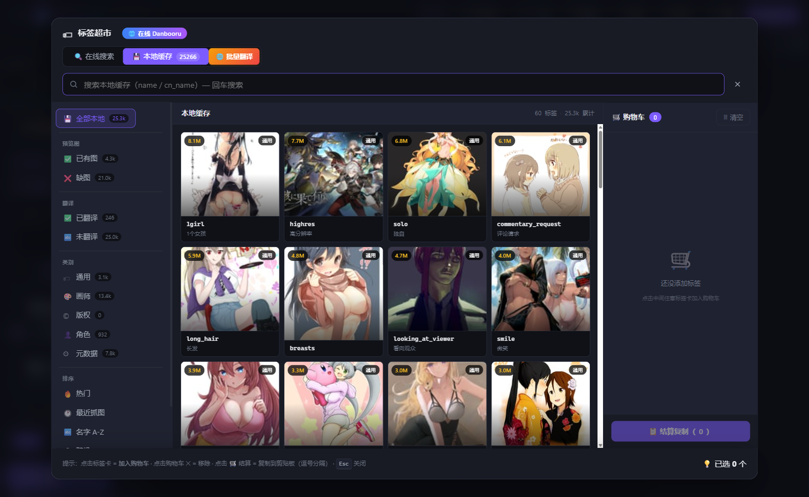
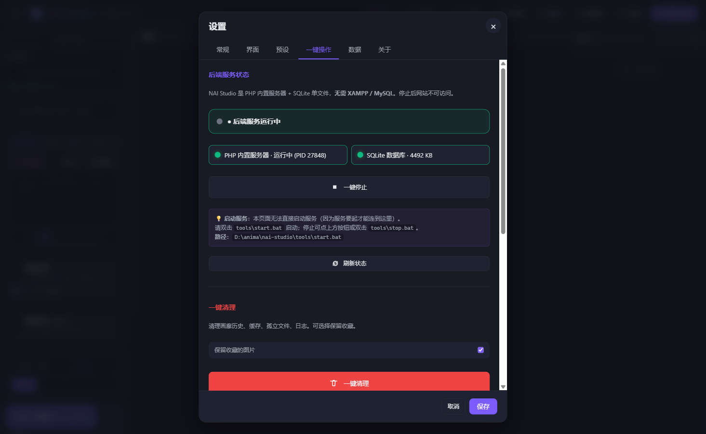
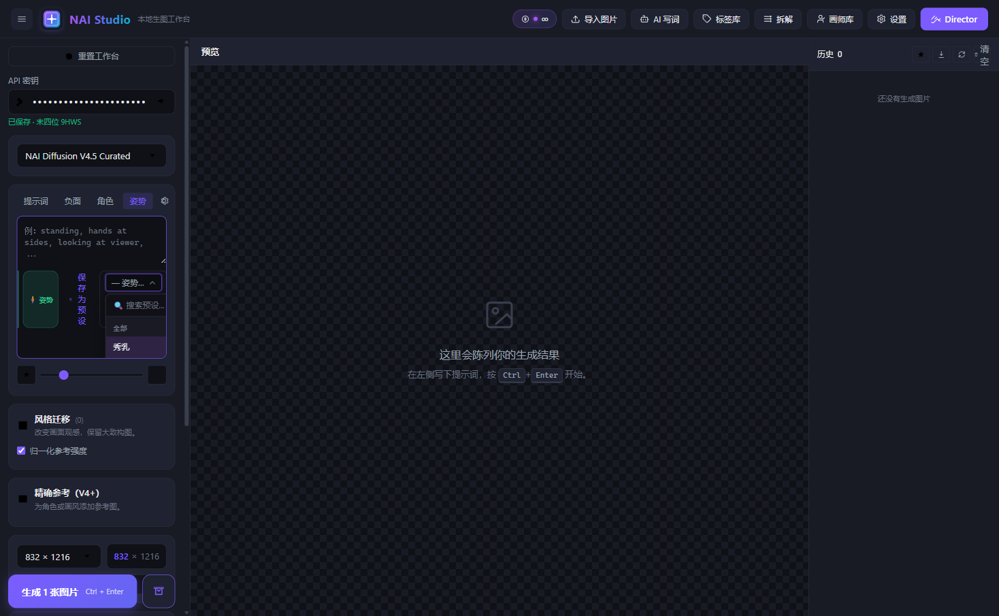

# NAI Studio · 本地生图工作台

> 像用 [studio.mmw.ink](https://studio.mmw.ink/novelai-byok) 那样在本地浏览器里调用 NovelAI 的 API，
> **专为利用 NAI 免费无限小图连续出图而设计**——所有数据留在你自己的电脑上。

[](LICENSE)
[](https://www.php.net)
[](https://sqlite.org)
[](#-快速开始)
[](#-快速开始)
[](https://novelai.net)
[](CHANGELOG.md)

---

## ✨ 这是什么

**NAI Studio** 是一个开箱即用的**本地生图工作台**，桥接你的 [NovelAI](https://novelai.net) 账号和你的浏览器。
把 API Key 输一次，剩下的就是"配队列 → 连续跑 → 收一堆图"的爽感。

### 🎯 核心优势：**队列连续生图**

NAI 对 Paper / Tabletop 会员的**小图（≤832×1216）是不限量的**。
其他工具让你"点一次出一张"，NAI Studio 让你"配好一组姿势 × 张数，关浏览器，让它自己跑完"：

- 🧪 **姿势工程队列** — 预设多组姿势 × 不同张数，按队列跑
- 🚀 **小图无限模式** — 自动选用 NAI unlimited 尺寸，间隔可设为 0
- 📊 **今日已生统计** — 顶栏显示"今日已生 N 张"
- 🖥 **CLI 后台模式** — 一键复制 `php generate.php` 命令到剪贴板，关浏览器继续跑
- 📦 **一键打包下载** — 把历史图按"全部/收藏"批量打成 zip，含 `manifest.json`

### 🛠 全部特性

| 类别 | 功能 |
|---|---|
| **生图** | NAI 全模型（V4.5 Curated/Full、V4、V3、Furry 3）、4 档参考图（Vibe Transfer / Precise References / img2img / inpainting）、mask editor |
| **标签** | Danbooru 在线搜索 + 本地缓存 25000+ 标签（带预览图）、500+ 内置中文翻译字典、批量翻译未翻译 tag、手动纠正 |
| **画师** | 内置画师库（按风格 tier S/A/B/C/D 分级）+ 收藏 + 风格覆盖 / 负向过滤 + Danbooru 在线搜 + 自定义画师管理 |
| **提示词** | 多块提示词（主/角色/姿势/质量/UC）+ 预设库（主/角色/姿势 三类共享，含收藏/删除/搜索 combobox） |
| **AI 写词** | DeepSeek V4-Flash / V3.5 / 等 OpenAI 兼容模型，多轮对话式生成 + `prompt` 代码块识别 + 一键插入 |
| **拆解** | 粘贴任意提示词 → 自动拆分中英 tag → 分类 + 加权 + 翻译 → 一键应用 |
| **持久化** | 本地优先 + 浏览器 localStorage 同步双保险、API key 服务端 AES-256-GCM 加密存、提示词同步到服务端 |
| **网络** | 代理支持（Clash/V2Ray）、Cloudflare WAF 自动重试、5xx 自动重试 2 次、429 按 Retry-After 等 |
| **多 Key** | 多个 NAI API Key 自动轮换（401/402/429 立即换、5xx 当前 key 重试 2 次再换） |
| **UI** | 暗色 / 极夜 / 浅色 3 主题、标签超市购物车 + Danbooru 在线 / 本地缓存 双 tab、预设 combobox 搜索 |

> 🆕 **v1.1.4 更新要点**：[CHANGELOG.md](CHANGELOG.md) | [UPDATE_NOTES.md](UPDATE_NOTES.md)
> 主要：零依赖便携版（自带 39MB PHP runtime）+ 修了 4 个会让 server 永久死锁的 bug + 本地翻译 NLLB-200

---

## 🚀 快速开始

### 零依赖便携版（v1.1.4+）

> 项目自带精简 **PHP 8.2 runtime**（runtime\php\，**39 MB**），**完全无需装 PHP / 服务器**——解压就能跑。

1. 解压项目到任意目录（**路径不要有中文**，避免 `php -S` 路径解析问题）
2. 双击 `tools\start.bat`
3. 浏览器自动打开 http://127.0.0.1:8080/nai-studio/
4. 顶部输 NAI Token → 保存 → 出图

> 用户数据自动写到 `user-data\`（首次启动时从 `user-data\data-tpl\` 复制模板）。
> 整个 `user-data\` 都可以安全备份 / 移动 / gitignore——**重装项目不会丢数据**。

### 标准版（用系统 PHP）

只需要 **PHP 8.0+**（推荐 8.2）和浏览器。**不需要 MySQL / MariaDB / Apache / nginx**——NAI Studio 用 PHP 内置服务器 + SQLite 单文件。

```bash
# 验证 PHP 已装（任意位置都行）
php -v
```

如果 `php` 不在 PATH，可以装到 `C:\php\php.exe` 或 `C:\Program Files\php\php.exe`，start.bat 会自动检测。

### 启动

**Windows** — 双击 `tools\start.bat`，会自动：
1. 检查 PHP（runtime\ 或系统 PATH）+ SQLite DB
2. 杀掉占用 8080 端口的旧进程
3. 首次启动：把 `user-data\data-tpl\` 模板复制到 `user-data\`
4. 后台启动 PHP 内置服务器（脱离窗口生命周期）
5. 等端口就绪 → 写 PID 文件
6. 打开浏览器到 http://127.0.0.1:8080/nai-studio/

**手动启动**（任意系统）：
```bash
php -S 127.0.0.1:8080 -t public public/router.php
```

**停止** — 双击 `tools\stop.bat`，或设置页 → 后端服务状态 → 一键停止。

### 配 API Key

打开站点 → 顶部 "API 密钥" 输入框 → 粘 NAI Token → 保存。
Key 用 **AES-256-GCM** 加密存在本地 SQLite，不会明文上传。

### 第一次生图

左侧 tab 选 "提示词" → 输入一段 → 点 "生成 1 张图片" → 等 5-10 秒 → 右侧预览出图。

### 想自动跑

打开 "工程队列" 模态（顶部"队列"按钮）→ 配"姿势预设 × 张数" → 启队列 → 关浏览器，后台自己跑。

---

## 📂 目录结构

```
nai-studio/
├── public/                    # Web 根目录
│   ├── index.php              # 前端 SPA 入口
│   ├── router.php             # PHP 内置 server 路由
│   ├── api/                   # 所有后端 API endpoint
│   │   ├── backend.php        # 后端服务控制（status/start/stop）
│   │   ├── generate.php       # 生图主入口（含 5xx/429 重试、key 轮换）
│   │   ├── tags.php           # 标签 CRUD + 翻译 + 计数
│   │   ├── artists.php        # 画师 CRUD + Danbooru 搜索
│   │   ├── danbooru.php       # Danbooru API 代理
│   │   ├── settings.php       # 设置（API key / 代理 / AI 写词 / 主题）
│   │   ├── artist_presets.php # 画师 / 提示词预设
│   │   ├── character_presets.php # 角色预设
│   │   ├── pose_presets.php   # 姿势预设
│   │   ├── tag_image.php      # 标签预览图（拉取 + 缓存）
│   │   └── admin/             # 管理员 API（批量抓图 / 翻译 / 扩充，长任务 detached 到 CLI）
│   ├── assets/
│   │   ├── js/                # ES Modules（importmap 加载）
│   │   ├── css/               # 样式
│   │   └── fonts/             # 字体
│   └── favicon.*
├── runtime/                   # 🆕 v1.1.4 自带 PHP 8.2 NTS（39 MB，便携模式用）
│   └── php/
│       ├── php.exe            #   精简过的 PHP runtime
│       ├── php.ini
│       └── ext/               #   curl/openssl/sqlite3/mbstring/gd/zip/opcache ...
├── user-data/                 # 🆕 用户运行时数据（首次启动自动创建，git 排除）
│   ├── nai-studio.db          #   SQLite 数据库（含 API key + 历史 + 全部设置）
│   ├── storage/               #   生成的图 / 缩略图 / 标签预览图 / 上传
│   ├── logs/                  #   日志（含 php-server.log）
│   └── data-tpl/              #   模板（项目升级时不会覆盖 user-data）
├── data/                      # 旧版数据位置（兼容中，新版写 user-data\）
│   ├── nai-studio.db
│   ├── schema_sqlite.sql
│   └── backups/
├── tools/
│   ├── start.bat              # 一键启动（自动选 runtime\php\ 或系统 PHP）
│   ├── stop.bat               # 一键停止
│   ├── expand_tags_cli.php    # CLI：批量扩充本地标签库（detached 进程）
│   ├── fetch_all_images_cli.php  # CLI：批量下载标签预览图（detached 进程）
│   ├── fetch_all_tag_images.php  # 旧 CLI（v1.1.0 兼容）
│   └── migrate_*.php          # 数据库迁移脚本
├── translate-server/          # 独立本地翻译服务（Node.js + NLLB-200）
│   ├── start.bat              # 双击启动
│   ├── stop.bat
│   ├── server.js
│   └── package.json
├── docs/
│   └── ui-screenshots/        # 文档截图
├── src/                       # 共享 PHP 类库
│   ├── lib/                   # Db / Settings / NaiApi / Translator / TagDict / ...
│   ├── config.php             # 数据库配置（自动检测 user-data 模式）
│   └── bootstrap.php
├── tests/                     # 测试 + 迁移脚本
├── CHANGELOG.md
├── README.md
└── LICENSE
```

---

## ⚙️ 配置

### 设置面板（推荐）

顶部 → "设置" → 4 个 tab：

| Tab | 内容 |
|---|---|
| **常规** | NAI API key（多 key 轮换 / 自动 / 手动）、提示词默认值、采样器、步数、尺寸、UC 预设 |
| **界面** | 主题（暗色 / 极夜 / 浅色 / 跟随系统）、强调色、强调强度 |
| **预设** | 主 / 角色 / 姿势 3 类预设统一管理（搜索、收藏、删除） |
| **一键操作** | **后端服务状态**（PHP server + SQLite 状态 / 启动 / 停止） + **一键清理**（历史 / 缓存 / 孤立文件） |
| **数据** | 导入 / 导出 / 重置 |
| **关于** | 版本 / 链接 / 检查更新 |

### API Key 管理

支持**多 key 自动轮换**（v1.1.0+）：
- 设置 → 常规 → API 密钥 → 添加多个 key（label / 末四位 / 启用 switch）
- 401 / 402 / 429 / 网络错误 → **立即跳到下一个 key**
- 5xx → 当前 key 内重试 2 次再换
- Anlas 余额显示**所有 key 的最小值**

### 代理

设置 → 数据 → 代理：
- 启用代理 + 填地址（`http://127.0.0.1:7890` 等）
- 所有外部请求（NAI / Danbooru / 翻译）都走代理
- 解决 Cloudflare WAF 拦 PHP curl（TLS 指纹）问题

### AI 写词

设置 → 数据 → AI 写词：
- Provider：DeepSeek（推荐，免费）/ OpenAI / 自定义 OpenAI 兼容
- API key / Base URL / Model / Reasoning effort
- 顶部 "AI 写词" 按钮打开对话窗口，多轮聊，自动识别 `prompt` 代码块并显示"插入主提示词"按钮

### 本地翻译

`translate-server\` 是独立的 Node.js 服务（用 OPUS-MT 本地翻译）：
- 第一次启动下载模型 ~300MB
- 之后秒起
- 启动后设置 → 启用本地翻译 + 填 `http://127.0.0.1:5555`

---

## 🧪 数据库

NAI Studio 默认用 **SQLite 单文件**。无需任何外部服务，**copy 文件就能备份**。

- 便携模式：`user-data\nai-studio.db`（首次启动从 `user-data\data-tpl\` 复制）
- 标准模式：`data\nai-studio.db`

切回旧版：把 `user-data\nai-studio.db` 拷回 `data\`，或反之。

如果你要换成 MariaDB / MySQL（不建议，单文件 SQLite 已够用）：改 `src/config.php` 里的 `driver` + `dsn` + `user` + `password`，然后 `php tools/migrate_mysql_to_sqlite.php`（或反向）。

主要表：

| 表 | 用途 |
|---|---|
| `settings` | 单行 k/v：API key、代理、AI 配置、UI 状态、Anlas 余额 |
| `tags` | 本地缓存的 Danbooru tag（含 cn_name 翻译 + 预览图路径） |
| `artists` | 内置 + 用户自定义画师 |
| `tag_categories` | Danbooru 分类（通用 / 画师 / 版权 / 角色 / 元数据） |
| `danbooru_tag_cache` | Danbooru tag 元数据缓存 |
| `prompt_presets` / `character_presets` / `pose_presets` | 3 类预设 |
| `generation_history` | 生图历史（用于画廊、统计、CLI 后台） |
| `nai_api_keys` | 多 API key（加密存 + 轮换状态） |

---

## 🔌 HTTP API（给 CLI 后台模式用）

所有 endpoint 都在 `public/api/` 下，常用：

| Method | URL | 说明 |
|---|---|---|
| GET | `/api/backend.php?action=status` | 后端服务状态 |
| POST | `/api/backend.php?action=stop` | 停止服务 |
| GET | `/api/tags.php?action=local_list&has_cn=0` | 未翻译的本地 tag 列表 |
| POST | `/api/tags.php?action=translate_one` | 重译单条（TagDict → MyMemory 兜底） |
| POST | `/api/tags.php?action=manual_translate` | 手动纠正翻译 |
| POST | `/api/generate.php` | 异步生图（含 5xx/429 自动重试、多 key 轮换） |
| GET | `/api/admin/fetch_all_images.php?action=stats` | 标签预览图覆盖率 |

更多见 `public/api/*.php` 顶部注释。

---

## 🐛 常见问题

**Q: 启动后 "后端服务未启动"？**
A: 打开设置 → 后端服务状态 → 看绿色"运行中"就 OK。如果红，去看 `storage/logs/php-server.log` 错误。

**Q: 生成 5xx 错误一直重试都失败？**
A: 99% 是 Cloudflare WAF。设置 → 代理 → 启用 → 填 Clash/V2RayN 的 http 端口（127.0.0.1:7890）。

**Q: 401 / "Missing accessToken"？**
A: API key 没保存。检查顶部 "API 密钥" 输入框 → 保存。

**Q: 429 Anlas 用完？**
A: 等隔天 / 加 API key（多 key 轮换）。Paper 会员**小图不限量**——检查尺寸是否 ≤832×1216。

**Q: 启动报 "PHP not found"？**
A: **v1.1.4+ 自带 PHP runtime（runtime\php\）**，正常不会报这个错。如果报：
1. 检查 `runtime\php\php.exe` 是不是被杀毒软件隔离了
2. 删掉 `runtime\php\` → 用 `tools\_setup_php.py` 重新解压（脚本会从 windows.php.net 拉官方 zip）
3. 或者装系统 PHP 到 `C:\php\php.exe` 等 start.bat 自动检测的路径

**Q: 想完全卸载重装？**
A: 删整个 `user-data\` 就回到出厂状态（不删 `runtime\`）。`data\` 是旧版数据位置，新装不会动。

**Q: 提示词/角色/姿势预设丢失？**
A: 检查浏览器 localStorage（devtools → Application → Local Storage） + 后端 SQLite (`data/nai-studio.db` 的 `prompt_presets` / `character_presets` / `pose_presets` 表)。

---

## 📸 截图

| 截图 | 说明 |
|---|---|
|  | 标签超市：本地缓存 tab 25k 标签 + 已翻译/未翻译筛选 |
|  | 设置页：PHP server (PID) + SQLite 状态，一键停止 |
|  | 姿势预设：搜索框 + 收藏分组 + 滚动列表 |

更多截图在 `docs/ui-screenshots/`。

---

## 🛠 开发

```bash
# 调试模式（不要后台）
php -S 127.0.0.1:8080 -t public public/router.php
```

数据迁移：每次改 schema 加一个新文件 `tools/migration_NNN_xxx.php`。

前后端分：
- 后端：`public/api/*.php` 接收 GET/POST，返回 JSON
- 前端：`public/assets/js/*.js` ES Modules（importmap 加载，无打包）
- 共享类：`src/lib/*.php` 自动加载（`src/bootstrap.php` 入口）

---

## 📜 协议

[MIT](LICENSE) — 随便用，但要保留版权。

## 🙏 致谢

- [NovelAI](https://novelai.net) — 提供 API
- [Danbooru](https://danbooru.donmai.us) — 标签数据源
- [tags.novelai.dev](https://tags.novelai.dev) — 标签 UI 灵感
- [Monxia](https://github.com/cyan-2048/Monxia) — 部分 UI 灵感
- DeepSeek — 免费 AI 写词服务

---

[English](#) · **简体中文**
